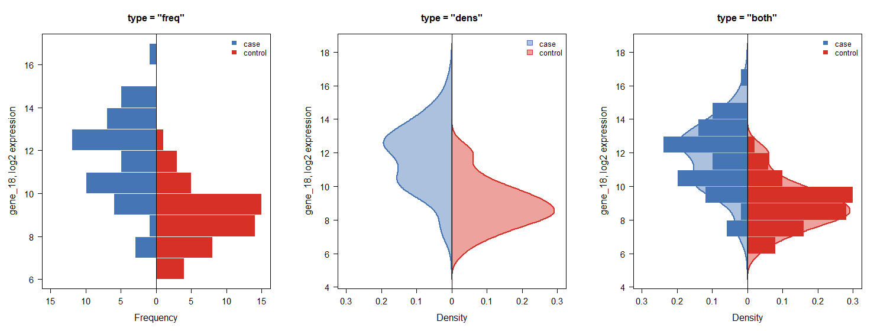

# STATassist

**STATassist** runs every test that applies to a comparison scenario in one call and returns standardised, feature-wise tables: parametric, rank-based and robust tests side by side, with fold changes, intervals and multiplicity-adjusted p-values. Significance tables, forest plots, volcano plots, boxplots and back-to-back histograms all read from the same result object, so effect sizes and p-values always describe the same observations.

Two groups, three or more groups and a single sample all return the same object, so `plot()`, `estimate_significance()` and anything else that reads a result works across them without being told which scenario produced it.

Dependencies are limited to base R (`stats`, `graphics`, `grDevices`, `utils`).

## Example

The volcano plot below is exactly what **Quick start §1–2** produce on 20 simulated genes, five of them planted up and five planted down in `case`. Since the answer is known, **§3** scores the plot against it: eight of the ten planted genes are called, and none of the ten null ones.


`plot()` on the same result draws the estimates against their intervals, and on a multi-group result it drops through to the pairwise contrasts, since an omnibus test has no interval of its own:

| Two groups, `plot(comp_res)` | Three groups, `plot(multi, type = "posthoc")` |
| --- | --- |
|  |  |

Grouped boxplots and a back-to-back histogram use the same wide data interface:

| Boxplot (three species of `iris`) | Butterfly histogram (one gene, case vs control) |
| --- | --- |
|  |  |

---

## Installation

Install from GitHub:

```r
# install.packages("remotes")
remotes::install_github("hiows/STATassist")          # latest
remotes::install_github("hiows/STATassist@v0.2.0")   # pinned to a release
```

Each release is tagged, so the pinned form keeps returning the same code no matter what lands on the default branch afterwards. `v0.1.0` is the previous release, and [NEWS.md](NEWS.md) says what changed between them.

The package is not on CRAN yet. When it is submitted, this README will note the CRAN line as well.

---

## Quick start

```r
library(STATassist)
```

### 1. Compare two groups (all applicable tests)

Wide `data.frame`: one row per observation, numeric columns are features. Direction is fixed by `group_lv` (`group_lv[1]` vs `group_lv[2]` for differences and fold change).

`simulate_two_groups()` returns data in exactly that shape along with the effects it planted, so every number below can be held against what was actually there. Twenty features, five moved up and five moved down in `case`, the other ten null. Its `args` element is named after the arguments of `compare_two_groups()`, so it can be spread out as below, or handed over whole with `do.call(compare_two_groups, sim_data$args)`.

```r
sim_data <- simulate_two_groups(n_feats = 20, n_up = 5, n_down = 5, seed = 3)

comp_res <- compare_two_groups(
  data        = sim_data$args$data,
  feats       = sim_data$args$feats,
  group       = sim_data$args$group,
  group_lv    = sim_data$args$group_lv,
  input_scale = sim_data$args$input_scale
)

comp_res
comp_res$effect          # fold_change, log2fc per feature
comp_res$tests$t_test    # Welch or paired t, depending on paired =
comp_res$tests$wilcox_test
comp_res$tests$robust_test
```

```
<sa_two_group> two_group_comparison
  groups   : case vs control  (independent)
  features : 20
  settings : alternative = two.sided, conf_level = 0.95, p_adjust = BH

  tests
    $t_test       8 of 20 at pval_adj <= 0.05
                 Welch's t-test
    $wilcox_test  6 of 20 at pval_adj <= 0.05
                 Wilcoxon rank sum test (Mann-Whitney U test)
    $robust_test  6 of 20 at pval_adj <= 0.05
                 Brunner-Munzel test

  $diagnostics attached
```

`group_lv` is `c("case", "control")`, so a positive `log2fc` means higher in `case`, which is where the effects were planted.

The data is on the log2 scale, as gene expression usually is, which is what `input_scale = "log2"` says. Dividing two means of logged values is not a fold change and can even come out with the wrong sign: log2 centres of -1 and -2 are a two-fold increase, but their ratio reads as a two-fold decrease. Each observation is raised back through `2^x` before the centres are taken, and `fc_mean` then defaults to `"geom"`, which makes `log2fc` the difference of the two log2 means.

Only `comp_res$effect` is converted. The tests still run on the log2 values, which is the reason for logging them in the first place.

```r
# The same quantity reached from the raw side, since exp(mean(log(2^v)))
# is 2^mean(v).
sim_raw <- sim_data$args$data
sim_raw[] <- 2^sim_raw

res_geom <- compare_two_groups(
  data     = sim_raw,
  feats    = sim_data$args$feats,
  group    = sim_data$args$group,
  group_lv = sim_data$args$group_lv,
  fc_mean  = "geom"
)

all.equal(comp_res$effect, res_geom$effect)
#> [1] TRUE
```

Note that this is the geometric mean fold change. On raw data `"arith"`, the default there, is a different centre and gives a different number.

Paired example (`sleep`, same subjects under two drugs):

```r
paired_res <- compare_two_groups(
  data     = sleep["extra"],
  feats    = "extra",
  group    = sleep$group,
  group_lv = c("1", "2"),
  id       = sleep$ID,
  paired   = TRUE,
  alternative = "less"
)
paired_res$tests$t_test
```

### 2. Significance and volcano plot

`estimate_significance()` takes the comparison object and applies cutoffs to `log2fc` and p-values. By default it uses the adjusted p-values already stored in the result (`adj_type = NULL` avoids double adjustment).

```r
sig <- estimate_significance(comp_res)   # log2fc_cutoff = 1, pval_cutoff = 0.05

draw_volcano_plot(sig, main = "Case vs control")
```

The defaults are a two-fold change and an adjusted p-value of 0.05. Pass `log2fc_cutoff` and `pval_cutoff` to move them, and `test = "wilcox_test"` or `test = "robust_test"` to threshold on a different family; `log2fc` stays the same because it comes from `comp_res$effect`.

### 3. Score the verdict against the planted answer

The comparison above ran on data whose answer is known, so the verdict can be scored rather than trusted. Unplanted features have a true fold change of exactly zero, which makes anything called among them a false positive by definition.

```r
planted <- sim_data$truth$direction != "none"
table(planted = planted, called = sig$is_signif %in% TRUE)
```

```
       called
planted FALSE TRUE
  FALSE    10    0
  TRUE      2    8
```

Eight of the ten planted features come back and none of the ten null ones is called. The two that were missed are worth looking up rather than guessing at, which is what the rest of `truth` is for:

```r
missed <- planted & !(sig$is_signif %in% TRUE)
sim_data$truth[missed, ]
sig[missed, ]
```

```
  features direction   log2fc baseline  sd_case sd_control
1   gene_1        up 1.246895 3.680415 2.119483   1.537763
7   gene_7        up 1.245580 3.246334 2.639624   1.257371

  features    log2fc     pvalue adj_pvalue is_signif
1   gene_1 0.5859900 0.06298298  0.1399622     FALSE
7   gene_7 0.7230514 0.11892653  0.2378531     FALSE
```

Both were planted at a log2 fold change of about 1.25, just above the cutoff, and both were estimated at well under 1. Nothing went wrong: an estimate carries a sampling error of its own, so a feature planted near the cutoff lands below it a good share of the time, and the same noise keeps its p-value from clearing 0.05 either. That is the third reason a real volcano plot loses features, next to the p-value cutoff and the multiplicity adjustment, and it is the one a simulation that recovers everything would hide.

```r
## Recall differs between the three families on the same data and the same truth
vapply(names(comp_res$tests), function(nm) {
  hit <- estimate_significance(comp_res, test = nm)$is_signif
  mean(hit[planted] %in% TRUE)
}, numeric(1))
```

```
     t_test wilcox_test robust_test 
        0.8         0.6         0.6 
```

Twenty features is a small problem. `simulate_two_groups()` defaults to 100 features with 15 up and 15 down, where the multiplicity adjustment has far more to correct for and recall drops accordingly.

### 4. Compare three or more groups, with the matching post-hoc stage

Four omnibus tests run side by side, each paired with the pairwise procedure that shares its assumptions: ANOVA with Tukey HSD, Welch's ANOVA with Games-Howell, Yuen's trimmed-mean ANOVA with pairwise Yuen, Kruskal-Wallis with Dunn's test. Pairing them in the result is what makes it impossible to follow a rank-based omnibus test with a parametric comparison by accident.

The remaining sections use `iris`, which has the three species a multi-group comparison needs.

```r
feats <- c("Sepal.Length", "Sepal.Width", "Petal.Length", "Petal.Width")

multi <- compare_multiple_groups(
  data     = iris,
  feats    = feats,
  group    = iris$Species,
  group_lv = levels(iris$Species)   # the first level is the reference
)

multi
multi$tests$anova_test      # F, df, eta_sq, omega_sq, adjusted p
multi$posthoc$anova_test    # one row per feature and pair of levels
multi$posthoc$kruskal_test  # Dunn's, on the same features
```

```
      features n_used     f_stat    eta_sq     pval_adj
1 Sepal.Length    150  119.26450 0.6187057 2.226226e-31
2  Sepal.Width    150   49.16004 0.4007828 4.492017e-17
3 Petal.Length    150 1180.16118 0.9413717 1.142711e-90
4  Petal.Width    150  960.00715 0.9288829 8.338892e-85
```

An omnibus test reports that the levels are not all alike, not by how much, so its `lower_conf` and `upper_conf` are `NA` throughout and the intervals live in `$posthoc` instead. `estimate` there reads as `group1 - group2`:

```
      features               contrast estimate     pval_adj
1 Sepal.Length    setosa - versicolor   -0.930 3.386180e-14
2 Sepal.Length     setosa - virginica   -1.582 2.997602e-15
3 Sepal.Length versicolor - virginica   -0.652 8.287558e-09
```

The pairwise stage runs only for features whose omnibus test cleared `posthoc_alpha`. A feature that did not qualify is **absent** from the post-hoc table rather than present with `NA`, because "never asked" and "asked and unanswerable" are different facts; `multi$parameters$n_posthoc` records how many features entered.

Repeated conditions need `id` and a complete rectangle. Subjects missing any condition are dropped whole and listed in `design$unmatched_ids`:

```r
chicks <- ChickWeight[ChickWeight$Time %in% c(0, 6, 12, 18), ]

rm_res <- compare_multiple_groups(
  data     = data.frame(weight = chicks$weight),
  feats    = "weight",
  group    = paste0("day", chicks$Time),
  group_lv = c("day0", "day6", "day12", "day18"),
  id       = chicks$Chick,
  paired   = TRUE
)

# Mauchly's sphericity test and both epsilon corrections sit on the same row
rm_res$tests$anova_test[, c("f_stat", "pval", "mauchly_pval", "gg_eps", "pval_gg")]
```

```
    f_stat         pval mauchly_pval   gg_eps      pval_gg
1 267.5938 2.637852e-57 8.779229e-41 0.392112 5.018735e-24
```

Sphericity is badly violated here, which is exactly why the corrected p-value is reported next to the uncorrected one rather than instead of it. Repeated measures also swap in Friedman as `$tests$kruskal_test`, with Conover's pairwise comparisons behind it.

### 5. Compare one sample against a hypothesised value

```r
one <- compare_one_sample(iris, "Sepal.Length", mu = 5.8)
one$tests$t_test
```

```
      features n_used   center  mu       diff     stderr    t_stat  df
1 Sepal.Length    150 5.843333 5.8 0.04333333 0.06761132 0.6409184 149
    cohens_d      pval  pval_adj lower_conf upper_conf
1 0.05233076 0.5225603 0.5225603   5.709732   5.976934
```

`$tests$wilcox_test` adds the signed-rank test with a Hodges-Lehmann pseudo-median, and `$tests$prop_test` a score test with a Wilson interval for binary features. A feature that is not binary produces an `NA` row and one named warning rather than a silently coerced number:

```r
binary <- transform(mtcars, am = as.numeric(am))
compare_one_sample(binary, "am", mu = 0.5, p = 0.4)$tests$prop_test
```

### 6. Check the assumptions before choosing a test

Each assumption is checked twice, by tests that fail differently: Shapiro-Wilk against Kolmogorov-Smirnov for normality, median-centred Levene against Bartlett for homogeneity of variance.

```r
d <- diagnose_distribution(iris, feats, iris$Species)
d
d$normality   # one row per feature and level
d$variance    # one row per feature
d$summary     # normal_ok / variance_ok flags per feature
```

```
<sa_diagnosis> distribution_diagnosis
  features : 4
  groups   : setosa, versicolor, virginica
  settings : alpha = 0.05, outlier criterion = iqr

  checks
    normality  1 of 4 feature(s) have a group failing Shapiro-Wilk at 0.05
    variance   3 of 4 feature(s) fail Levene at 0.05
    outliers   13 observation(s) flagged across 4 feature(s)

  A failed check never changes which tests run. It changes which of
  them deserves the most weight, and that judgement stays with you.
```

A failed check never blocks an analysis and never swaps one test for another. It changes which member of the reported family deserves the most weight: skewed groups favour the rank-based and robust members, unequal variances favour Welch's and Brunner-Munzel's treatments of the same data.

`screen_outliers()` flags observations and **does not remove them**. `row` is the row number in the original `data`, so a flagged point can be looked up:

```r
screen_outliers(iris, feats, iris$Species)                    # 1.5 x IQR fences
screen_outliers(iris, feats, criterion = "robust_z")          # median and MAD
screen_outliers(iris, feats, criterion = "grubbs", alpha = 0.05)
```

```
      features     group row value    score
1 Sepal.Length virginica 107   4.9 1.962963
2  Sepal.Width    setosa  16   4.4 1.526316
3  Sepal.Width    setosa  42   2.3 1.894737
4  Sepal.Width virginica 118   3.8 1.666667
```

The same checks are attached to every comparison as `$diagnostics` unless you pass `diagnose = FALSE`.

### 7. `plot()`: one method for every scenario

`plot()` reads only the columns the result contract guarantees, which is why one method covers all three scenarios. `type = "auto"`, the default, picks the first view the chosen table can support.

```r
plot(comp_res)                                   # estimates with intervals
plot(comp_res, test = "wilcox_test", sort_by = "pvalue")
plot(multi, type = "posthoc", feature = "Petal.Length")
plot(multi, test = "kruskal_test", type = "pvalue")
plot(comp_res, dark = TRUE)
```

The p-value view is the fallback for a table with no interval to draw, and marks the `alpha` threshold:


### 8. Grouped boxplot

```r
draw_grouped_boxplot(
  data     = iris,
  feats    = feats,
  group    = iris$Species,
  group_lv = levels(iris$Species),
  ylab     = "cm",
  main     = "Iris by species",
  dark     = TRUE   # or FALSE for a light theme
)
```

### 9. Back-to-back histogram (two groups only)

```r
draw_butterfly_hist(
  data     = sim_data$args$data,
  feat     = "gene_18",
  group    = sim_data$args$group,
  group_lv = sim_data$args$group_lv,
  breaks   = 12,
  scale    = "proportion",   # or "count"
  type     = "freq",         # or "dens" / "both" for a kernel density estimate
  ylab     = "gene_18, log2 expression",
  main     = "Planted up in case"
)
```

The call returns bin summaries and per-group `histogram` objects for further plotting, plus per-group `density` objects when a density is drawn.



A density and a bar can only be read against one axis when the bar is a density too: a count or a proportion per bin scales with the bin width, which the curve knows nothing about. So `type = "dens"` and `type = "both"` move `scale` to `"density"`, and reject a `scale` that was asked for explicitly and says otherwise rather than drawing two incomparable shapes.

```r
drawn <- draw_butterfly_hist(
  data        = sim_data$args$data,
  feat        = "gene_18",
  group       = sim_data$args$group,
  group_lv    = sim_data$args$group_lv,
  breaks      = 12,
  type        = "both",
  dens_adjust = 1.8,                      # smooth the shape further
  dens_col    = c("#08306B", "#67000D"),  # one outline colour per level
  dens_alpha  = 0.45                      # fill opacity, so the bars show through
)
drawn$group_densities$case
```

### 10. Descriptive statistics

```r
summarize_descriptive_stats(iris, feats)

# By group (one row per feature × level)
summarize_descriptive_stats(
  iris, feats, iris$Species,
  group_lv = c("virginica", "versicolor", "setosa")
)
```

---

## Main functions

| Function | Purpose |
| --- | --- |
| `compare_two_groups()` | Welch / Wilcoxon / robust tests plus fold change for two groups |
| `compare_multiple_groups()` | Four omnibus tests for three or more groups, each with its matching post-hoc stage; independent or repeated |
| `compare_one_sample()` | One-sample t, signed-rank and proportion tests against a hypothesised value |
| `diagnose_distribution()` | Normality, homogeneity of variance and outliers for a set of features |
| `screen_outliers()` | Flag observations by IQR fences, robust z or Grubbs, without removing them |
| `estimate_significance()` | Filter features by log2FC and p-value from any comparison result |
| `plot()` (`sa_comparison`) | Forest plot of estimates, of pairwise contrasts, or of p-values |
| `draw_volcano_plot()` | Volcano plot from `estimate_significance()` output |
| `draw_grouped_boxplot()` | Boxplots for several features × group levels |
| `draw_butterfly_hist()` | Back-to-back histogram, kernel density, or both, for exactly two groups |
| `summarize_descriptive_stats()` | Feature-wise (and optional group-wise) descriptive table |
| `simulate_two_groups()` | Two-group log2 expression data with the planted answer returned alongside it |

---

## Author

**Wonseok Oh** ([ORCID: 0009-0002-0687-8466](https://orcid.org/0009-0002-0687-8466))

## License

MIT © 2026 Wonseok Oh. See [LICENSE.md](LICENSE.md) for details.
