# STATassist

**STATassist** runs every method that applies to a question in one call and returns standardised tables. A comparison reports parametric, rank-based and robust tests side by side, with fold changes, intervals and multiplicity-adjusted p-values. A model reports one row per term with its estimate and whatever inference that model honestly supports. A dimension reduction reports one row per point with its coordinates. Three result contracts, and everything downstream reads them rather than the engine underneath.

Two groups, three or more groups and a single sample all return the same object, so `draw_forest_plot()`, `estimate_significance()` and anything else that reads a result works across them without being told which scenario produced it. Five models — linear, logistic, penalized, forest and kernel — return the same object too, so `coef()` and `predict(model, newdata = )` are one line each whichever of them was fitted.

Every example below runs on simulated data whose answer was planted on purpose, so a verdict can be **scored** rather than trusted: `simulate_two_groups()`, `simulate_multiple_groups()`, `simulate_regression()` and `simulate_classification()` hand back the effects and coefficients they put in.

The comparison, diagnostic and visualisation functions use base R only (`stats`, `graphics`, `grDevices`, `utils`). The modelling and dimension-reduction functions are built on `caret` and call `glmnet`, `randomForest`, `kernlab`, `Rtsne` and `umap` through it.

## Example

The volcano plot below is what **§1–§2** produce on 30 simulated genes, eight of them planted up and eight planted down in `case`. Since the answer is known, **§3** scores the plot against it: 13 of the 16 planted genes are called, and none of the 14 null ones.


`draw_forest_plot()` on the same result draws either the estimates against their intervals or the p-values against the threshold, from the same table:

| `type = "estimate"` | `type = "pvalue"` |
| --- | --- |
| 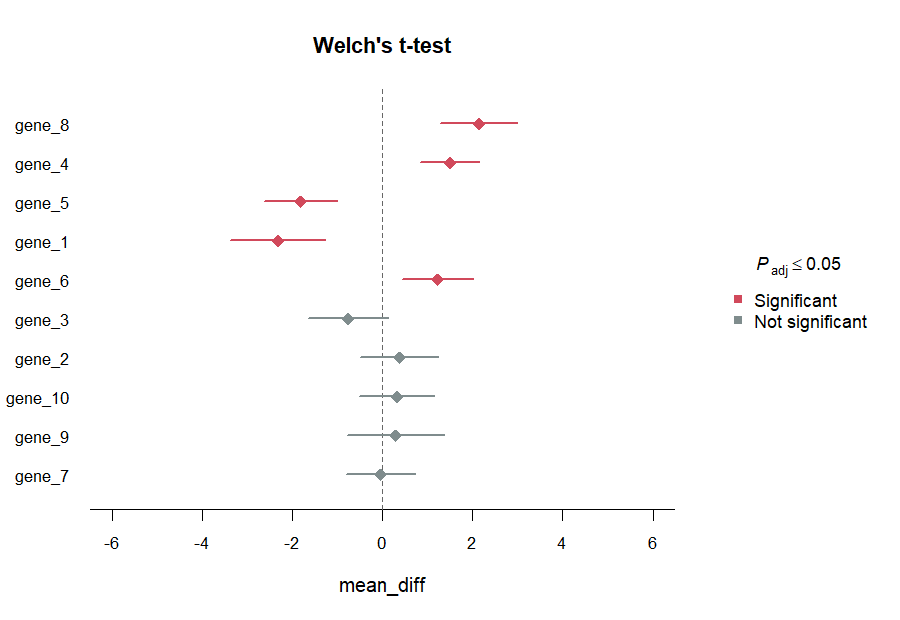 | 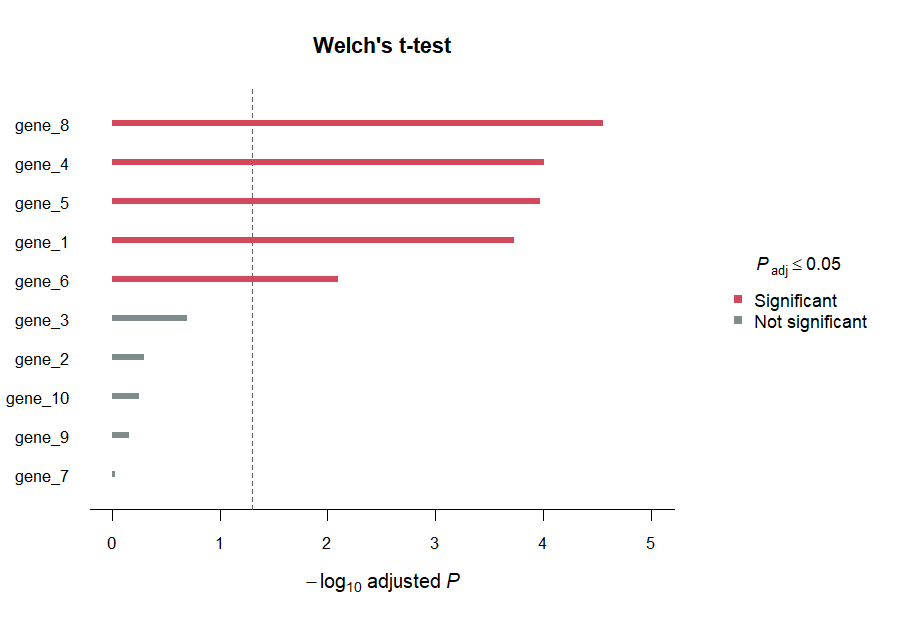 |

And the same wide input feeds the plots that look at the data instead of at a result:

| Grouped boxplot | Back-to-back histogram |
| --- | --- |
|  |  |

---

## Installation

Install from GitHub:

```r
# install.packages("remotes")
remotes::install_github("hiows/STATassist")          # latest
remotes::install_github("hiows/STATassist@v0.6.0")   # pinned to a release
```

Each release is tagged, so the pinned form keeps returning the same code no matter what lands on the default branch afterwards. `v0.2.0` is the previous release, and [NEWS.md](NEWS.md) says what changed between them — which is a great deal, including a reversal of which level of `group_lv` a two-group comparison treats as the reference. NEWS.md says what to swap.

The package is not on CRAN yet. When it is submitted, this README will note the CRAN line as well.

---

# Part 1 — Comparison

```r
library(STATassist)
```

### 1. Compare two groups (all applicable tests)

Wide `data.frame`: one row per observation, numeric columns are features. Direction is fixed by `group_lv`, whose first level is the reference: differences read `group_lv[2] - group_lv[1]` and fold changes `group_lv[2] / group_lv[1]`. The same rule holds for three or more groups, so a control named first stays the reference whichever function reads it.

`simulate_two_groups()` returns data in exactly that shape along with the effects it planted. Thirty features, eight moved up and eight moved down in `case`, the other fourteen null. Its `args` element is named after the arguments of `compare_two_groups()`, so it can be spread out as below, or handed over whole with `do.call(compare_two_groups, sim$args)`.

```r
sim <- simulate_two_groups(n_feats = 30, n_up = 8, n_down = 8, seed = 2026)

comp_res <- compare_two_groups(
  data        = sim$args$data,
  feats       = sim$args$feats,
  group       = sim$args$group,
  group_lv    = sim$args$group_lv,
  input_scale = sim$args$input_scale
)

comp_res
comp_res$effect          # fold_change, log2fc per feature
comp_res$tests$t_test    # Welch or paired t, depending on paired =
comp_res$tests$wilcox_test
comp_res$tests$robust_test
```

```
<sa_two_group> two_group_comparison
  groups   : control vs case  (independent)
  features : 30
  settings : alternative = two.sided, conf_level = 0.95, p_adjust = BH

  tests
    $t_test       13 of 30 at pval_adj <= 0.05
                 Welch's t-test
    $wilcox_test  11 of 30 at pval_adj <= 0.05
                 Wilcoxon rank sum test (Mann-Whitney U test)
    $robust_test  12 of 30 at pval_adj <= 0.05
                 Brunner-Munzel test

  $diagnostics attached
```

`group_lv` is `c("control", "case")`, so `control` is the reference and a positive `log2fc` means higher in `case`, which is where the effects were planted.

```r
head(comp_res$effect, 4)
```

```
  features   x_center   y_center fold_change     log2fc
1   gene_1 116.645989 580.265253   0.2010218 -2.3145758
2   gene_2 273.339540 210.363380   1.2993685  0.3778106
3   gene_3   5.534795   9.386638   0.5896461 -0.7620787
4   gene_4 106.679403  37.811073   2.8213799  1.4964010
```

The centres are in the hundreds while the features themselves run from about 1 to 15, because the data is on the log2 scale, as gene expression usually is, which is what `input_scale = "log2"` says. Dividing two means of logged values is not a fold change and can even come out with the wrong sign: log2 centres of -1 and -2 are a two-fold increase, but their ratio reads as a two-fold decrease. Each observation is raised back through `2^x` before the centres are taken, and `fc_mean` then defaults to `"geom"`, which makes `log2fc` the difference of the two log2 means.

Only `comp_res$effect` is converted. The tests still run on the log2 values, which is the reason for logging them in the first place.

```r
# The same quantity reached from the raw side, since exp(mean(log(2^v)))
# is 2^mean(v).
sim_raw <- sim$args$data
sim_raw[] <- 2^sim_raw

res_geom <- compare_two_groups(
  data     = sim_raw,
  feats    = sim$args$feats,
  group    = sim$args$group,
  group_lv = sim$args$group_lv,
  fc_mean  = "geom"
)

all.equal(comp_res$effect, res_geom$effect)
#> [1] TRUE
```

Note that this is the geometric mean fold change. On raw data `"arith"`, the default there, is a different centre and gives a different number.

Paired example (`sleep`, same subjects under two drugs):

```r
paired_res <- compare_two_groups(
  data     = sleep["extra"],
  feats    = "extra",
  group    = sleep$group,
  group_lv = c("1", "2"),
  id       = sleep$ID,
  paired   = TRUE,
  alternative = "less"
)
paired_res$tests$t_test
```

### 2. Significance and volcano plot

`estimate_significance()` takes the comparison object and applies cutoffs to `log2fc` and p-values. `adj_type = NULL`, the default, uses the adjusted p-values already stored in the result and so avoids double adjustment; naming a method re-adjusts from `pval`.

```r
sig <- estimate_significance(
  comp_res,
  test          = "t_test",
  log2fc_cutoff = 1,
  pval_cutoff   = 0.05,
  adj_type      = "BH"
)
sig

verdict <- sig$significance   # one row per feature
draw_volcano_plot(sig, xlim = c(-3, 3))
```

```
<sa_significance> two_group_comparison
  test     : t_test  (Welch's t-test)
  cutoffs  : abs(log2fc) >= 1, adj_pvalue <= 0.05  (BH)
  verdict  : 13 of 30 significant
```

The verdict comes back as `$significance`, a data.frame of `features`, `log2fc`, `pvalue`, `adj_pvalue` and `is_signif`, beside the `$analysis_type` it was read from. The scenario name travels with the table because `log2fc` does not mean the same thing in all three: with two groups it is the second level over the reference, with three or more it is the level furthest from the reference, which is why a multi-group volcano plot says so on its x axis.

Pass `test = "wilcox_test"` or `test = "robust_test"` to threshold on a different family; `log2fc` stays the same because it comes from `comp_res$effect`.

### 3. Score the verdict against the planted answer

The comparison above ran on data whose answer is known, so the verdict can be scored rather than trusted. Unplanted features have a true fold change of exactly zero, which makes anything called among them a false positive by definition.

```r
planted <- sim$truth$direction != "none"
table(planted = planted, called = verdict$is_signif %in% TRUE)
```

```
       called
planted FALSE TRUE
  FALSE    14    0
  TRUE      3   13
```

Thirteen of the sixteen planted features come back and none of the fourteen null ones is called. The three that were missed are worth looking up rather than guessing at, which is what the rest of `truth` is for:

```r
missed <- planted & !(verdict$is_signif %in% TRUE)
sim$truth[missed, ]
verdict[missed, ]
```

```
   features direction    log2fc baseline  sd_case sd_control
3    gene_3      down -1.091246 3.401400 2.823662   1.879291
23  gene_23      down -1.849667 4.325627 3.141577   2.138058
26  gene_26        up  1.212882 3.855122 2.802282   2.373063
   features     log2fc     pvalue adj_pvalue is_signif
3    gene_3 -0.7620787 0.09393639  0.2012923     FALSE
23  gene_23 -0.8510372 0.15229026  0.3045805     FALSE
26  gene_26  0.5736033 0.31638180  0.4745727     FALSE
```

`gene_3` and `gene_26` were planted at about 1.1 and 1.2, barely over the cutoff, and both were estimated under 0.8. Nothing went wrong: an estimate carries a sampling error of its own, so a feature planted near the cutoff lands below it a good share of the time, and the same noise keeps its p-value from clearing 0.05 either. That is the third reason a real volcano plot loses features, next to the p-value cutoff and the multiplicity adjustment, and it is the one a simulation that recovers everything would hide.

`gene_23` is the more interesting miss. It was planted at 1.85, well clear of the cutoff, and still came back at 0.85 — and its `sd_case` of 3.14 against a `sd_control` of 2.14 is why. A group whose spread was widened along with its centre is harder to distinguish, not easier, and `truth` records both so the two can be read together.

```r
## Recall differs between the three families on the same data and the same truth
vapply(names(comp_res$tests), function(nm) {
  hit <- estimate_significance(comp_res, test = nm)$significance$is_signif
  mean(hit[planted] %in% TRUE)
}, numeric(1))
```

```
     t_test wilcox_test robust_test 
     0.8125      0.6875      0.7500 
```

### 4. Grouped boxplot and back-to-back histogram

Both read the same wide input the comparison took, and both draw the levels in the order `group_lv` gives them, so the reference lands on the left.

```r
first_ten <- paste0("gene_", 1:10)

draw_grouped_boxplot(
  data     = sim$args$data,
  feats    = first_ten,
  group    = sim$args$group,
  group_lv = sim$args$group_lv,
  ylim     = c(-5, 20)
)
```


```r
draw_butterfly_hist(
  data     = sim$args$data,
  feat     = "gene_8",
  group    = sim$args$group,
  group_lv = sim$args$group_lv,
  breaks   = seq(-5, 20, by = 1),
  type     = "both"        # or "freq" for bars only, "dens" for the curve only
)
```


The call returns bin summaries and per-group `histogram` objects for further plotting, plus per-group `density` objects when a density is drawn. A density and a bar can only be read against one axis when the bar is a density too: a count or a proportion per bin scales with the bin width, which the curve knows nothing about. So `type = "dens"` and `type = "both"` move `scale` to `"density"`, and reject a `scale` that was asked for explicitly and says otherwise rather than drawing two incomparable shapes.

```r
drawn <- draw_butterfly_hist(
  data        = sim$args$data,
  feat        = "gene_8",
  group       = sim$args$group,
  group_lv    = sim$args$group_lv,
  breaks      = seq(-5, 20, by = 1),
  type        = "both",
  dens_adjust = 1.8,                      # smooth the shape further
  dens_col    = c("#08306B", "#67000D"),  # one outline colour per level
  dens_alpha  = 0.45                      # fill opacity, so the bars show through
)
drawn$group_densities$case
```

### 5. `draw_forest_plot()`: one function for every scenario

`draw_forest_plot()` reads only the columns the result contract guarantees, which is why one function covers all three scenarios. `type = "auto"`, the default, picks the first view the chosen table can support. `plot()` on a `sa_comparison` is the same function under the name R users reach for first, so the first two lines below are interchangeable.

```r
draw_forest_plot(comp_res)                       # estimates with intervals
plot(comp_res)                                   # the same call

draw_forest_plot(comp_res, test = "wilcox_test", sort_by = "pvalue")
draw_forest_plot(comp_res, dark = TRUE)
```

`feats` picks the features to draw and the order to draw them in, from the top of the plot down, and `sort_by` reorders whatever `feats` selected. `xlim` fixes the axis instead of deriving it, so two plots can be read against each other.

```r
draw_forest_plot(
  comp_res, test = "t_test", type = "estimate",
  feats = first_ten, sort_by = "pvalue", xlim = c(-6, 6)
)
```


The p-value view is the fallback for a table with no interval to draw, and marks the `alpha` threshold. It is also worth asking for on purpose, since it puts the whole selection on one scale:

```r
draw_forest_plot(
  comp_res, test = "t_test", type = "pvalue",
  feats = first_ten, sort_by = "pvalue"
)
```


`use_adjusted = FALSE` reads the `pval` column instead of `pval_adj`. The colouring, the sorting, the p-value view and the legend all follow it, so the plot always names the p-value it actually used.

### 6. Clustered heatmap

The same wide input, transposed so that features run down the rows. `group` labels the samples, which become the columns, and the strip above them is drawn from it. `stats::heatmap()` draws the cells, the strip and the trees; the upright colour key and the group legend beside it are added afterwards, since it draws none:

```r
drawn <- draw_heatmap(
  data              = sim$args$data,   # a matrix works too
  group             = sim$args$group,
  group_lv          = sim$args$group_lv,
  scale             = "feature",       # or "sample" / "none"
  hclust_method     = "ward.D2",
  show_sample_names = FALSE            # 100 samples, no room for 100 labels
)
```

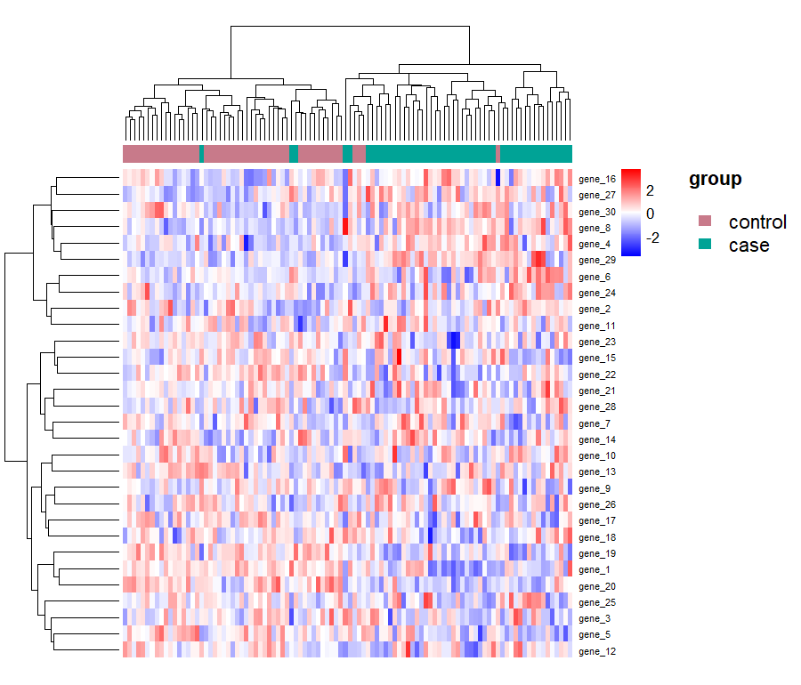

Nothing in the plot was told where the groups are, and it still puts the 17 leftmost columns in `control` and 29 of the 50 `case` samples together in one run. It is not two clean blocks, and it should not be: fourteen of these genes were planted with no effect at all, and the planted half carries enough noise that **§3** misses three of them.

Features are z-scored across the samples by default. One colour scale is shared by every cell and features are not measured on a common scale, so without it a single high-abundance feature takes the whole range and the rest of the plot is left white. The plot does not name which `scale` ran, but the numbers beside the colour key are whatever it produced, and `matrix` on the result is the scaled data.

`feats` picks the features to draw, and their order when they are not clustered:

```r
planted_feats <- sim$truth$features[sim$truth$direction != "none"]
draw_heatmap(
  data              = sim$args$data,
  group             = sim$args$group,
  group_lv          = sim$args$group_lv,
  feats             = planted_feats,
  cluster_feats     = FALSE,           # keep the order `feats` names
  dist_method       = "correlation",   # group samples by profile shape
  hclust_method     = "ward.D2",
  show_sample_names = FALSE
)
```

The clustering comes back on the result rather than staying inside the picture, so what the plot claims can be checked:

```r
rownames(drawn$matrix)          # features, top to bottom as drawn
drawn$feat_hclust               # the hclust object behind the row dendrogram
rle(as.character(sim$args$group)[drawn$sample_order])
```

Missing values are drawn as grey cells rather than dropped, and a feature with no variance is centred instead of divided by zero. When a pair of features shares no observed sample there is no distance between them at all, in which case that axis keeps its input order and says so rather than failing.

### 7. Compare three or more groups, with the matching post-hoc stage

Four omnibus tests run side by side, each paired with the pairwise procedure that shares its assumptions: ANOVA with Tukey HSD, Welch's ANOVA with Games-Howell, Yuen's trimmed-mean ANOVA with pairwise Yuen, Kruskal-Wallis with Dunn's test. Pairing them in the result is what makes it impossible to follow a rank-based omnibus test with a parametric comparison by accident.

`simulate_multiple_groups()` builds one control group and any number of treatment groups, and `n_treat` states how many by its length.

```r
sim_multi <- simulate_multiple_groups(
  n_feats   = 10,
  n_control = 50,
  n_treat   = c(50, 50, 50),
  n_up      = 3,
  n_down    = 3,
  seed      = 2026
)

multi <- compare_multiple_groups(
  data        = sim_multi$args$data,
  feats       = sim_multi$args$feats,
  group       = sim_multi$args$group,
  group_lv    = sim_multi$args$group_lv,
  input_scale = sim_multi$args$input_scale
)

multi
multi$tests$anova_test[, c("features", "n_used", "f_stat", "eta_sq", "pval_adj")]
```

```
   features n_used     f_stat      eta_sq     pval_adj
1    prot_1    200 15.5709484 0.192461364 4.007090e-08
2    prot_2    200  5.3653151 0.075889925 3.575055e-03
3    prot_3    200  4.3704284 0.062700036 1.054867e-02
4    prot_4    200  0.1977247 0.003017267 8.978535e-01
5    prot_5    200  0.4906963 0.007454669 7.657082e-01
6    prot_6    200  1.2876072 0.019327364 3.498056e-01
7    prot_7    200 13.3218691 0.169370477 2.988271e-07
8    prot_8    200  1.3413981 0.020118538 3.498056e-01
9    prot_9    200  2.5466629 0.037517133 9.533879e-02
10  prot_10    200 10.5506865 0.139037001 6.104458e-06
```

An omnibus test reports that the levels are not all alike, not by how much, so its `lower_conf` and `upper_conf` are `NA` throughout and the intervals live in `$posthoc` instead. `estimate` there reads as `group1 - group2`, and the reference is the level being subtracted, so a contrast against it points the same way the fold change does:

```r
ph <- multi$posthoc$anova_test
ph[ph$features == "prot_1", c("features", "contrast", "estimate", "pval_adj")]
```

```
  features          contrast   estimate     pval_adj
1   prot_1 treat_1 - control  0.8950192 1.524659e-01
2   prot_1 treat_2 - control  0.2647502 9.239116e-01
3   prot_1 treat_3 - control  2.6276154 1.918369e-08
4   prot_1 treat_2 - treat_1 -0.6302689 4.465873e-01
5   prot_1 treat_3 - treat_1  1.7325962 3.630417e-04
6   prot_1 treat_3 - treat_2  2.3628651 4.752954e-07
```

`draw_forest_plot()` reaches the same rows with `type = "posthoc"`, which is what `type = "auto"` falls through to on an omnibus table:

```r
draw_forest_plot(multi, test = "anova_test", type = "posthoc", feats = "prot_1",
                 sort_by = "pvalue")
```

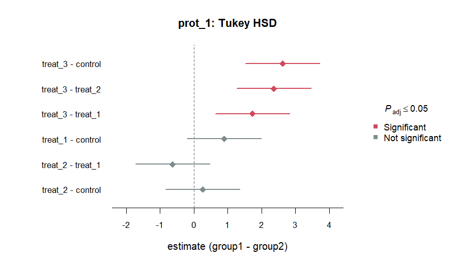

Only `treat_3` moved this feature, which is one of the three shapes `simulate_multiple_groups()` plants: `"all"` moves every treatment group alike, `"gradient"` moves them in a ramp, and `"single"` moves one and leaves the rest at exactly zero. They are recovered at visibly different rates by the same omnibus test, which is the point of planting more than one.

The pairwise stage runs only for features whose omnibus test cleared `posthoc_alpha`. A feature that did not qualify is **absent** from the post-hoc table rather than present with `NA`, because "never asked" and "asked and unanswerable" are different facts; `multi$parameters$n_posthoc` records how many features entered.

`$pairwise` holds the same numbers one contrast at a time, keyed by test and then by contrast label:

```r
names(multi$pairwise$anova_test)
multi$pairwise$anova_test[["treat_3 - control"]][
  , c("features", "log2fc", "estimate", "pval_adj")
]
```

```
[1] "treat_1 - control" "treat_2 - control" "treat_3 - control"
[4] "treat_2 - treat_1" "treat_3 - treat_1" "treat_3 - treat_2"
   features       log2fc   estimate     pval_adj
1    prot_1  2.627615364  2.6276154 1.918369e-08
2    prot_2  1.562213521  1.5622135 4.409768e-03
3    prot_3 -1.459508771 -1.4595088 9.464962e-03
4    prot_4 -0.269499199         NA           NA
5    prot_5  0.007238073         NA           NA
6    prot_6 -0.383242425         NA           NA
7    prot_7 -1.743104602 -1.7431046 1.463146e-04
8    prot_8 -0.610917723         NA           NA
9    prot_9  1.147411959         NA           NA
10  prot_10  0.178635827  0.1786358 9.701071e-01
```

These tables are rectangular where `$posthoc` is ragged: each holds every feature, in the order the rest of the object uses, so a feature that did not qualify is present with its inference columns `NA`. They add `log2fc`, which no post-hoc procedure reports, being the ratio of the two group centres rather than anything a test produced. It divides `group1` by `group2`, so it agrees in sign with the `estimate` beside it, and it is filled even where the test was never run.

The omnibus verdict and its volcano plot work the same way they did with two groups, except that `log2fc` is now the level furthest from the reference, which the x axis says:

```r
sig_multi <- estimate_significance(multi, test = "anova_test",
                                   pval_cutoff = 0.05, adj_type = "BH")
draw_volcano_plot(sig_multi, xlim = c(-4, 4))

draw_grouped_boxplot(
  data     = sim_multi$args$data,
  feats    = sim_multi$args$feats,
  group    = sim_multi$args$group,
  group_lv = sim_multi$args$group_lv,
  ylim     = c(-10, 20)
)
```

| Volcano plot, four groups | Boxplot, four groups |
| --- | --- |
| 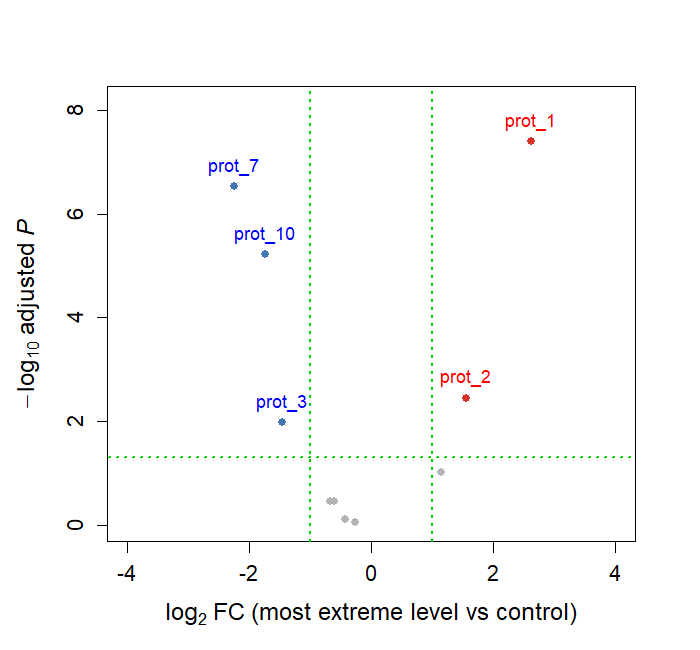 | 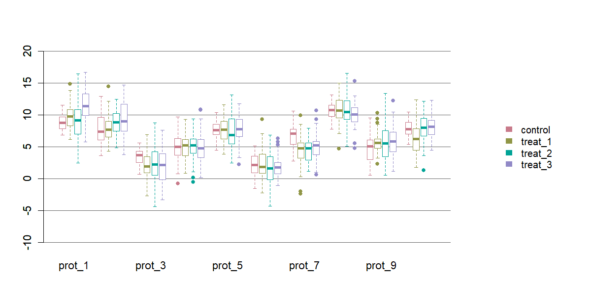 |

`estimate_significance(multi, by = "contrast")` reads the `$pairwise` tables instead, and its `$significance` is then one verdict table per contrast: `sig$significance[["treat_3 - control"]]` is what `draw_volcano_plot()` takes.

Repeated conditions need `id` and a complete rectangle; `simulate_multiple_groups(paired = TRUE)` builds one, and subjects missing any condition are dropped whole and listed in `design$unmatched_ids`.

```r
sim_paired <- simulate_multiple_groups(
  n_feats = 10, n_control = 50, n_treat = c(50, 50, 50),
  n_up = 3, n_down = 3, seed = 2026, paired = TRUE
)

rm_res <- compare_multiple_groups(
  data        = sim_paired$args$data,
  feats       = sim_paired$args$feats,
  group       = sim_paired$args$group,
  group_lv    = sim_paired$args$group_lv,
  id          = sim_paired$args$id,
  input_scale = sim_paired$args$input_scale,
  paired      = TRUE
)

# Mauchly's sphericity test and both epsilon corrections sit on the same row
rm_res$tests$anova_test[1:3, c("features", "f_stat", "pval", "mauchly_pval",
                               "gg_eps", "pval_gg")]
```

```
  features     f_stat         pval mauchly_pval    gg_eps      pval_gg
1   prot_1 21.1243904 1.958421e-11 0.0001389954 0.7346618 5.518760e-09
2   prot_2  0.9501076 4.181613e-01 0.0003986818 0.7597238 3.995928e-01
3   prot_3 11.6182657 7.062201e-07 0.0843851300 0.8906821 2.394895e-06
```

Sphericity is violated for the first two features here, which is exactly why the corrected p-value is reported next to the uncorrected one rather than instead of it. Repeated measures also swap in Friedman as `$tests$kruskal_test`, with Conover's pairwise comparisons behind it.

### 8. Compare one sample against a hypothesised value

```r
one <- compare_one_sample(sim$args$data, "gene_8", mu = 8)
one$tests$t_test
```

```
  features n_used   center mu     diff    stderr   t_stat df cohens_d
1   gene_8    100 11.41152  8 3.411517 0.2390404 14.27172 99 1.427172
          pval     pval_adj lower_conf upper_conf
1 9.163982e-26 9.163982e-26   10.93721   11.88583
```

`$tests$wilcox_test` adds the signed-rank test with a Hodges-Lehmann pseudo-median, and `$tests$prop_test` a score test with a Wilson interval for binary features. `gene_8` is not binary, so the call above also emits one named warning and leaves that row `NA` rather than coercing a number out of it:

```r
flag <- data.frame(is_case = as.numeric(sim$args$group == "case"))
compare_one_sample(flag, "is_case", mu = 0.5, p = 0.5)$tests$prop_test
```

```
  features n_used n_success proportion   p diff chi_sq df cohens_h pval
1  is_case    100        50        0.5 0.5    0      0  1        0    1
  pval_adj lower_conf upper_conf
1        1  0.4038315  0.5961685
```

### 9. Check the assumptions before choosing a test

Each assumption is checked twice, by tests that fail differently: Shapiro-Wilk against Kolmogorov-Smirnov for normality, median-centred Levene against Bartlett for homogeneity of variance.

```r
d <- diagnose_distribution(sim$args$data, sim$args$feats, sim$args$group)
d
d$normality   # one row per feature and level
d$variance    # one row per feature
d$summary     # normal_ok / variance_ok flags per feature
```

```
<sa_diagnosis> distribution_diagnosis
  features : 30
  groups   : case, control
  settings : alpha = 0.05, outlier criterion = iqr

  checks
    normality  2 of 30 feature(s) have a group failing Shapiro-Wilk at 0.05
    variance   15 of 30 feature(s) fail Levene at 0.05
    outliers   47 observation(s) flagged across 17 feature(s)

  A failed check never changes which tests run. It changes which of
  them deserves the most weight, and that judgement stays with you.
```

Half of these features fail the variance check, which is not a flaw in the data: `simulate_two_groups()` widens the spread of a group along with its centre, and `gene_23` in **§3** is what that costs. A failed check never blocks an analysis and never swaps one test for another. It changes which member of the reported family deserves the most weight: skewed groups favour the rank-based and robust members, unequal variances favour Welch's and Brunner-Munzel's treatments of the same data.

`screen_outliers()` flags observations and **does not remove them**. `row` is the row number in the original `data`, so a flagged point can be looked up:

```r
screen_outliers(sim$args$data, first_ten, sim$args$group)      # 1.5 x IQR fences
screen_outliers(sim$args$data, first_ten, criterion = "robust_z")
screen_outliers(sim$args$data, first_ten, criterion = "grubbs", alpha = 0.05)
```

```
  features   group row     value    score
1   gene_2    case  69 12.962802 1.657094
2   gene_4    case  59  1.849220 1.977710
3   gene_4    case  74  2.335740 1.731842
4   gene_4 control  18  9.149657 1.613356
```

The same checks are attached to every comparison as `$diagnostics` unless you pass `diagnose = FALSE`.

### 10. Descriptive statistics

```r
summarize_descriptive_stats(sim$args$data, paste0("gene_", 1:3))

# By group (one row per feature x level)
summarize_descriptive_stats(sim$args$data, "gene_8", sim$args$group,
                            group_lv = sim$args$group_lv)
```

```
  features   group  n n_missing     mean       sd      var        se        cv
1   gene_8 control 50         0 10.33740 1.375964 1.893278 0.1945907 0.1331054
2   gene_8    case 50         0 12.48563 2.701269 7.296853 0.3820171 0.2163502
       min        q1   median       q3      max      iqr out_lower_bound
1 5.939601  9.461326 10.37261 11.42933 13.81878 1.968002        6.509322
2 6.528890 11.489627 12.72451 14.10401 19.53043 2.614387        7.568047
  out_upper_bound      mad   skewness excess_kurtosis
1        14.38133 1.514535 -0.2724662       1.1000757
2        18.02560 2.036055 -0.1622755       0.3640198
```

---

# Part 2 — Modelling

A model has no feature axis. Every table in Part 1 repeats `features` in the same order; a model has one outcome and a set of **terms**, and the terms are not the columns that were handed in, since one factor predictor becomes several. `terms` takes the place of `features`, `coefficients$terms` repeats that order, and the eleven slots of an `sa_model` are the same eleven whichever of the five models produced it.

### 11. Data whose coefficients are known, and a split that does not leak

`make_block_cor()` builds the correlation the predictors are drawn with. Blocks may not overlap, and a matrix that is symmetric with a unit diagonal but describes no data that could exist is refused here rather than inside an engine:

```r
cor_mat <- make_block_cor(
  n_features = 8,
  blocks = list(
    list(features = 1:2, cor = 0.8),
    list(features = 3:5, cor = 0.5)
  )
)

sim_reg <- simulate_regression(cor_mat = cor_mat, seed = 2026)
subset(sim_reg$truth, role == "signal")
```

```
  predictors   role       beta direction value_mean value_sd max_cor_signal
1        x_1 signal  1.1993458        up          0        1              0
5        x_5 signal  0.5376967        up          0        1              0
7        x_7 signal -1.7915160      down          0        1              0
8        x_8 signal -0.8787518      down          0        1              0
```

Four predictors carry a coefficient and the other four are exactly zero, so a false positive is a count rather than an estimate. `max_cor_signal` is why the correlation blocks are there at all: `x_2` is null but correlates with the planted `x_1` at 0.8, and a null predictor that correlates with a planted one is pulled off zero by data alone. No number of rows fixes that, and every section below runs into it.

`truth` has one row per predictor; `truth_term` has one row per term, aligned with `coefficients` by position, since a three-level factor is two terms and a constant predictor is none.

`split_data()` defines what "the training half" means, and closes the two ways a training set learns what it must not. `stratified` keeps the balance of the whole data on both sides, and `id` sends every row of one sampling unit to the same side.

```r
dataset <- split_data(
  data       = sim_reg$args$data,
  stratified = sim_reg$args$data$x_cat_1,
  p_train    = 0.75,
  times      = 1,
  seed       = 2026
)
dataset

train_data <- dataset$datasets[[1]]$train_data
test_data  <- dataset$datasets[[1]]$test_data
```

```
<sa_split> train/test partition
  rows     : 200
  stratify : <vector>
             high 66, low 67, mid 67
  settings : p_train = 0.75, times = 1, seed = 2026

  splits
    $Resample1  train 152 / test 48  (p = 0.760)
```

`p_train` is a proportion of rows, or of units when `id` is given, and the row proportion actually reached is reported as `p` above and stored in `parameters$achieved_p`. The shape does not depend on `times`: `datasets` is a list of one when one split was asked for.

`sim_reg$split_args` is named after the arguments of `split_data()` for the same reason `args` is named after the arguments of the model, so either can be handed over with `do.call()`.

### 12. Linear regression

Every model takes `data`, `outcome` and `predictors`, and every one resamples the same way. Cross-validation here scores the fit and does not choose it: the final model is fitted on all usable rows either way, so `cv = TRUE` and `cv = FALSE` give identical coefficients and differ only in `performance` and `resampling`.

```r
lin <- fit_linear_regression(
  data       = train_data,
  outcome    = sim_reg$args$outcome,
  predictors = sim_reg$args$predictors,
  cv         = TRUE,
  cv_method  = "repeated_kfold",
  n_fold     = 10,
  n_repeat   = 3,
  seed       = 2026
)

lin
```

```
<sa_model> linear_regression
  outcome  : y  (continuous)
  rows     : 152 used
  terms    : 11 over 9 predictor(s)
  settings : repeated_kfold, 10 fold(s) x 3 repeat(s), conf_level = 0.95

  coefficients
    (Intercept)      -1.036  [-1.85, -0.226]  p = 0.0125
    x_1              0.4689  [-0.376, 1.31]  p = 0.274
    x_2              0.7246  [-0.127, 1.58]  p = 0.0948
    x_3              0.2052  [-0.382, 0.792]  p = 0.491
    x_4             -0.3861  [-0.924, 0.152]  p = 0.158
    x_5              0.9453  [0.425, 1.47]  p = 0.000451
    x_6             0.08831  [-0.369, 0.545]  p = 0.703
    x_7              -1.442  [-1.88, -1]  p = 1.48e-09
    x_8              -1.197  [-1.72, -0.671]  p = 1.43e-05
    x_cat_1mid        3.135  [1.97, 4.3]  p = 3.71e-07
    ... and 1 more term(s) in $coefficients

  fit      : r_squared = 0.495, adj_r_squared = 0.459, sigma = 2.75, f_stat =
             13.8, df1 = 10, df2 = 141, pval = 9.29e-17, aic = 751, bic = 788
  resample : RMSE = 2.81 (SD 0.5), Rsquared = 0.451 (SD 0.15), MAE = 2.22 (SD
             0.42) over 30 resample(s)
```

`coef()` on the result is the whole table. `coef()` on `$fit` is the named vector `lm` would have given, for indexing and multiplying:

```r
coef(lin)[, c("terms", "estimate", "pval")]
```

```
         terms    estimate         pval
1  (Intercept) -1.03596473 1.250653e-02
2          x_1  0.46894277 2.743564e-01
3          x_2  0.72456532 9.476519e-02
4          x_3  0.20519712 4.907838e-01
5          x_4 -0.38610825 1.582901e-01
6          x_5  0.94533612 4.510358e-04
7          x_6  0.08831122 7.030701e-01
8          x_7 -1.44197889 1.479616e-09
9          x_8 -1.19679727 1.431263e-05
10  x_cat_1mid  3.13513207 3.711674e-07
11 x_cat_1high -0.18221871 7.500329e-01
```

Three of the four planted coefficients are picked out at any usual threshold, and `x_1` is not: it is the one that correlates with `x_2` at 0.8, and the pair splits the effect between them at p = 0.27 and p = 0.09. This is `max_cor_signal` doing exactly what it records, and no amount of `n_fold` changes it.

Refit on the terms that survived a threshold, predict the held-out half, and read the two against each other. A factor has to be named as its column again, since `x_cat_1mid` is a term and `x_cat_1` is a predictor:

```r
terms_kept <- coef(lin)$terms[-1][coef(lin)$pval[-1] < 0.01]
kept <- unique(sub("high$", "", sub("mid$", "", terms_kept)))
kept
#> [1] "x_5"     "x_7"     "x_8"     "x_cat_1"

lin_kept <- fit_linear_regression(
  data       = train_data,
  outcome    = sim_reg$args$outcome,
  predictors = kept,
  cv         = TRUE, cv_method = "repeated_kfold",
  n_fold     = 10, n_repeat = 3, seed = 2026
)

y_hat <- predict(lin_kept, newdata = test_data)
round(cor(test_data$y, y_hat), 3)
#> [1] 0.827
```

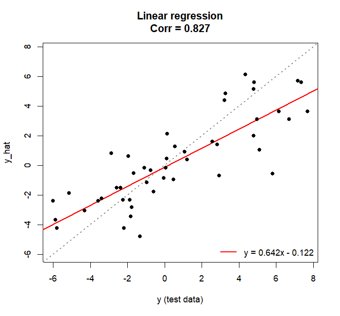

Dropping five predictors, one of them planted, cost 0.008 of correlation on the held-out half: 0.835 with all nine against 0.827 with four. The predictor that was lost was the one whose effect its correlated neighbour was already carrying.

`fit_stats` is a named list rather than a table, because these are quantities per model and not per term: `r_squared`, `adj_r_squared`, `sigma`, the F test, `aic` and `bic`.

### 13. Logistic regression

The same call with a two-class outcome. `outcome_lv` follows the `group_lv` rule — the first level is the reference — so the coefficients describe the odds of `outcome_lv[2]`, and a vector handed to both `compare_two_groups()` and this function points the same way in both.

```r
sim_cls <- simulate_classification(cor_mat = cor_mat, seed = 2026)

cls <- split_data(
  data       = sim_cls$args$data,
  stratified = sim_cls$args$data$y,   # about one row in four is an event
  p_train    = 0.75,
  times      = 1,
  seed       = 2026
)
cls_train <- cls$datasets[[1]]$train_data
cls_test  <- cls$datasets[[1]]$test_data

log_fit <- fit_logistic_regression(
  data       = cls_train,
  outcome    = sim_cls$args$outcome,
  predictors = sim_cls$args$predictors,
  outcome_lv = sim_cls$args$outcome_lv,
  cv         = TRUE, cv_method = "repeated_kfold",
  n_fold     = 10, n_repeat = 3, seed = 2026
)

log_fit
coef(log_fit)[, c("terms", "odds_ratio", "pval")]
```

```
<sa_model> logistic_regression
  outcome  : y  (two classes)
             modelling the odds of case against control, 39 of 150 row(s)
  rows     : 150 used
  terms    : 11 over 9 predictor(s)
  settings : repeated_kfold, 10 fold(s) x 3 repeat(s), conf_level = 0.95

  coefficients
    (Intercept)      -3.071  [-4.54, -1.6]  p = 4.28e-05
    x_1               2.081  [0.738, 3.42]  p = 0.00239
    x_2           -0.002994  [-1.12, 1.11]  p = 0.996
    x_3             -0.2176  [-0.972, 0.536]  p = 0.572
    x_4            -0.07222  [-0.829, 0.685]  p = 0.852
    x_5               0.972  [0.152, 1.79]  p = 0.0202
    x_6              0.3154  [-0.37, 1]  p = 0.367
    x_7              -2.377  [-3.39, -1.36]  p = 4.23e-06
    x_8               -0.74  [-1.37, -0.114]  p = 0.0205
    x_cat_1mid        2.756  [1.03, 4.48]  p = 0.00171
    ... and 1 more term(s) in $coefficients

  fit      : null_deviance = 172, residual_deviance = 76.1, df_null = 149,
             df_residual = 139, mcfadden_r2 = 0.558, lr_stat = 95.9, lr_df =
             10, lr_pval = 3.66e-16, aic = 98.1, bic = 131
  resample : Accuracy = 0.836 (SD 0.081), Kappa = 0.533 (SD 0.28) over 30
             resample(s)
```

```
         terms  odds_ratio         pval
1  (Intercept)  0.04637071 4.276342e-05
2          x_1  8.01038947 2.394441e-03
3          x_2  0.99701067 9.957929e-01
4          x_3  0.80444965 5.716053e-01
5          x_4  0.93032378 8.516444e-01
6          x_5  2.64318666 2.022411e-02
7          x_6  1.37075135 3.670408e-01
8          x_7  0.09286615 4.231261e-06
9          x_8  0.47711976 2.054874e-02
10  x_cat_1mid 15.73809479 1.706532e-03
11 x_cat_1high  0.33968065 1.743603e-01
```

All four planted predictors clear 0.05 here, and the two that were planted `down` come back with an odds ratio under one. The interval columns are `or_lower_conf` and `or_upper_conf`, exponentiated from the Wald interval on the log-odds scale rather than profiled, so the two numbers always agree with the standard error in the same row.

`predict(model, newdata = , type = "response")` is the probability of `outcome_lv[2]`, which is the second column of `type = "prob"` and the class in `type = "raw"`. Fitting the significant terms and the rest separately and drawing all three against the held-out half is what the figure below does:

```r
prob_all <- predict(log_fit, newdata = cls_test, type = "response")
roc_all <- pROC::roc(cls_test$y, prob_all, levels = c("control", "case"))
round(as.numeric(pROC::auc(roc_all)), 3)
#> [1] 0.917
```

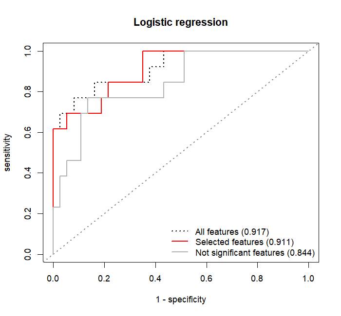

The five predictors behind the significant terms reach 0.911 against 0.917 for all nine, and the predictors behind the terms that were **not** significant still reach 0.844 — because `x_cat_1` appears in both sets. One of its two levels cleared the threshold and the other did not, so naming the columns behind the terms puts the factor on both sides. A term is not a predictor, and this is where the difference shows.

### 14. Elastic net

One function covers the three corners of one model: `"lasso"` is alpha 1, `"ridge"` is alpha 0, and `"elastic_net"` tunes alpha as well. The outcome type is read from the column, so the same call does regression and classification.

This is the first model where resampling **chooses** rather than scores. `parameters$lambda` and `parameters$alpha` are therefore the values that won, not the grid that was offered; the grid is the rows of `performance`.

```r
enet <- fit_elastic_net(
  data       = train_data,
  outcome    = sim_reg$args$outcome,
  predictors = sim_reg$args$predictors,
  penalty    = "lasso",
  lambda     = c(0.01, 0.1, 0.5, 1, 2),
  cv         = TRUE, cv_method = "repeated_kfold",
  n_fold     = 10, n_repeat = 3, seed = 2026
)

coef(enet)
```

```
         terms   estimate selected
1  (Intercept) -0.9499000     TRUE
2          x_1  0.4392503     TRUE
3          x_2  0.6072695     TRUE
4          x_3  0.0535525     TRUE
5          x_4 -0.1237904     TRUE
6          x_5  0.7752077     TRUE
7          x_6  0.0000000    FALSE
8          x_7 -1.3456974     TRUE
9          x_8 -1.0743007     TRUE
10  x_cat_1mid  2.8170913     TRUE
11 x_cat_1high -0.1891498     TRUE
```

There are no `stderr`, `pval` or interval columns here, and they are **absent rather than `NA`**. A penalized estimate is deliberately biased and the usual standard error assumes an unbiased one, so there is no honest number to put in them; a column of `NA` reads as a table with its values missing, which is a different claim. `selected` takes their place, and `is.null(coef(fit)$pval)` is how a consumer tells the two kinds of table apart. Every term keeps its row either way: a dropped term is `estimate = 0`, not a missing row.

At the winning `lambda = 0.1` the penalty drops only `x_6`, so it is a gentler filter than a p-value at 0.01 was — and on the held-out half the refit reaches 0.836, a shade above the linear model's 0.827.

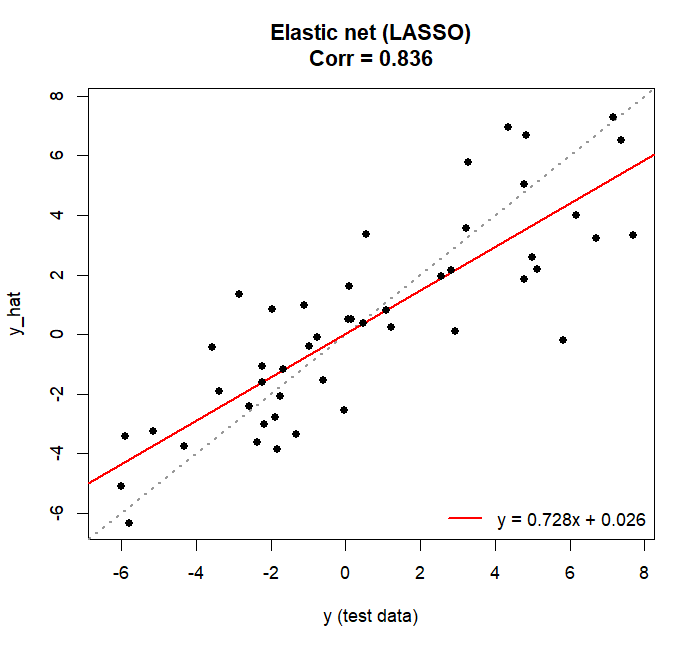

The classification path is the same call with `outcome_lv`, and it separates the kept terms from the dropped ones as clearly as the p-value did:

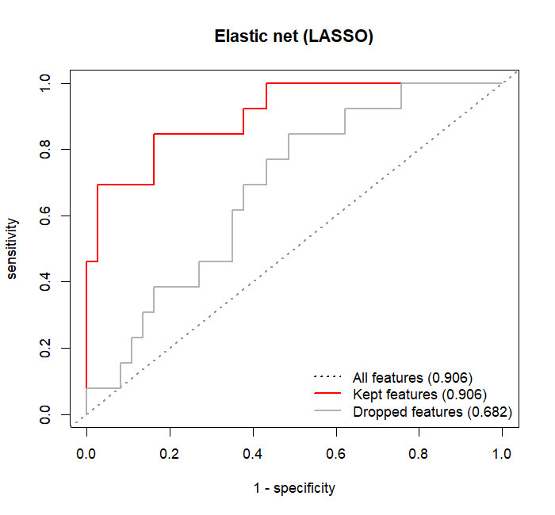

The terms LASSO kept reach 0.906 on the held-out half, the same as the full fit, and the ones it dropped reach 0.682.

### 15. Random forest

The first model with no coefficients. A forest holds hundreds of trees and their splits, not one effect per predictor, so `estimate` is **permutation importance** — `%IncMSE` for regression, `MeanDecreaseAccuracy` for classification — and the table is sorted by it, since that is the order worth reading first. `impurity` carries the other measure the same fit reports, because the two disagree in a way worth seeing: permutation is measured on out-of-bag rows, impurity on the splits themselves.

```r
rf <- fit_rf(
  data       = train_data,
  outcome    = sim_reg$args$outcome,
  predictors = sim_reg$args$predictors,
  mtry       = c(2, 5, 8),
  ntree      = 500,
  cv         = TRUE, cv_method = "repeated_kfold",
  n_fold     = 10, n_repeat = 3, seed = 2026
)

rf
coef(rf)
```

```
<sa_model> random_forest
  outcome  : y  (continuous)
  rows     : 152 used
  terms    : 9 over 9 predictor(s)
  settings : repeated_kfold, 10 fold(s) x 3 repeat(s)
  forest   : 500 tree(s), mtry = 5, nodesize = 5  (mtry chosen from 3 candidate(s))

  importance  (permutation)
    x_cat_1       2.835
    x_7           2.707
    x_5           1.429
    x_8          0.9525
    x_2          0.8965
    x_1          0.6468
    x_4        -0.02487
    x_6        -0.09821
    x_3         -0.1449

  fit      : oob_r_squared = 0.327, oob_rmse = 3.06, oob_mae = 2.41, n_oob =
             152
  resample : RMSE = 2.99 (SD 0.49), Rsquared = 0.378 (SD 0.18), MAE = 2.39
             (SD 0.38) over 30 resample(s)
```

```
    terms    estimate  impurity
1 x_cat_1  2.83479166 268.89580
2     x_7  2.70674308 420.78325
3     x_5  1.42927220 323.38487
4     x_8  0.95250001 252.16450
5     x_2  0.89647721 208.29766
6     x_1  0.64680537 174.57364
7     x_4 -0.02486564  95.13807
8     x_6 -0.09820752 156.14747
9     x_3 -0.14494930 120.42547
```

The three predictors at the bottom are **negative**, and that is an answer rather than a missing value: a predictor that carries nothing can do worse than its own permutation. All three are null, and the null `x_2` outranks the planted `x_1` on both measures, which is the 0.8 correlation between the two showing up a third time. Above that the two measures do not agree: `x_cat_1` leads on permutation and sits third on impurity, behind `x_7` and `x_5`.

Importance is not scaled by the between-tree standard deviation, which `randomForest::importance()` does by default. That ratio is referred to no distribution, so the mean loss itself is what the table carries.

`fit_stats` is out-of-bag rather than in-sample, and says so in its names: `oob_r_squared`, `oob_rmse`, `oob_mae`, and for classification `oob_accuracy`, `oob_kappa`, `oob_sensitivity` and `oob_specificity` against `outcome_lv[2]`. A third of the rows are out of bag for each tree and the forest has already predicted them from trees that never saw them, which is an honest held-out score for free. Here it is 3.06 against an in-sample RMSE that would flatter the fit.

A forest splits factors by level directly, so there is no dummy coding and `x_cat_1` is one term rather than two — unlike every other model in this part.

| Regression | Classification |
| --- | --- |
| 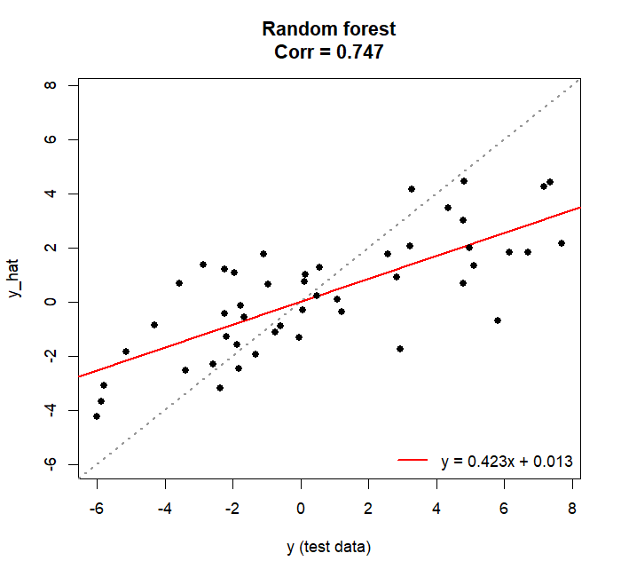 | 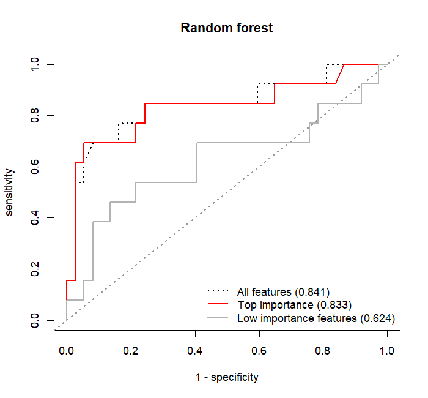 |

The forest is the weakest of the five on this data, at 0.747 held-out correlation and 0.841 AUC, which is what a flexible model costs on 152 rows with a mostly linear truth. Its top five and low five separate cleanly all the same: 0.833 against 0.624.

### 16. Support vector machine

The second model with no coefficients, for the opposite reason. A forest has too many numbers per predictor to report one; a radial kernel machine has **none** — it holds support vectors and their weights, which are points in the data rather than directions in the predictor space. So `estimate` is permutation importance again, measured in the metric the resampling tuned on, so the table and `performance` read in the same unit.

```r
svm <- fit_svm(
  data       = train_data,
  outcome    = sim_reg$args$outcome,
  predictors = sim_reg$args$predictors,
  C          = 2^seq(-5, 10, by = 2),
  sigma      = NULL,           # read from the data by kernlab::sigest()
  cv         = TRUE, cv_method = "repeated_kfold",
  n_fold     = 10, n_repeat = 3, seed = 2026
)

svm
names(coef(svm))
#> [1] "terms"    "estimate"
```

```
<sa_model> svm
  outcome  : y  (continuous)
  rows     : 152 used
  terms    : 10 over 9 predictor(s)
  settings : repeated_kfold, 10 fold(s) x 3 repeat(s)
  kernel   : radial, C = 0.5, sigma = 0.0487  (chosen from 8 candidate(s))

  importance  (permutation)
    x_7              0.6094
    x_cat_1mid       0.5242
    x_8               0.292
    x_5              0.2586
    x_2              0.1404
    x_1              0.1066
    x_cat_1high     0.06732
    x_6              0.0615
    x_4             0.05414
    x_3             0.04743

  fit      : r_squared = 0.516, rmse = 2.59, mae = 1.9, n_support_vector =
             136, support_vector_rate = 0.895
  resample : RMSE = 2.95 (SD 0.47), Rsquared = 0.413 (SD 0.16), MAE = 2.33
             (SD 0.38) over 30 resample(s)
```

Unlike the forest, this importance is measured on the rows the machine was fitted to, because a machine sees every row at once and has no out-of-bag half to permute. A term fitted to noise therefore earns a little importance it could not have earned out of sample, and the numbers at the bottom of this table are small rather than negative for that reason. `sigma = NULL` reads the kernel width from the data as the median of `kernlab::sigest()`, and the predictors are centred and scaled before the kernel measures a distance, so `sigma` is a width on the standardised scale.

| Regression | Classification |
| --- | --- |
| 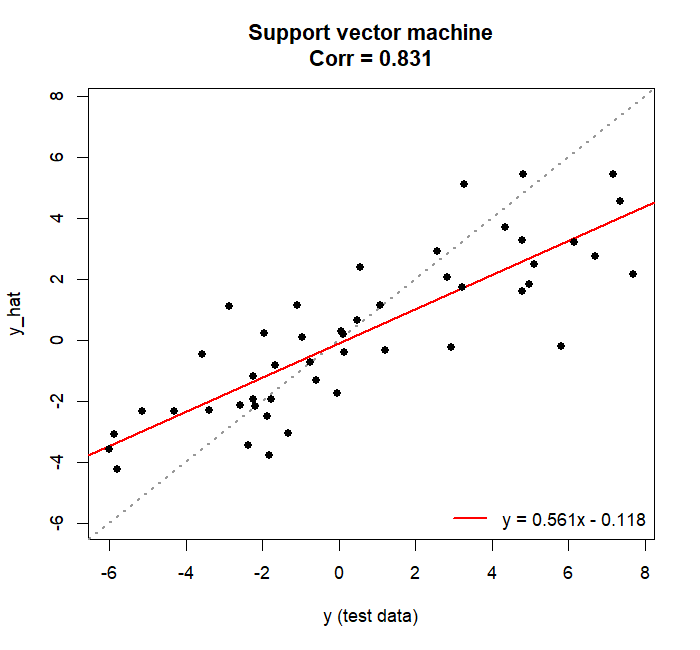 | 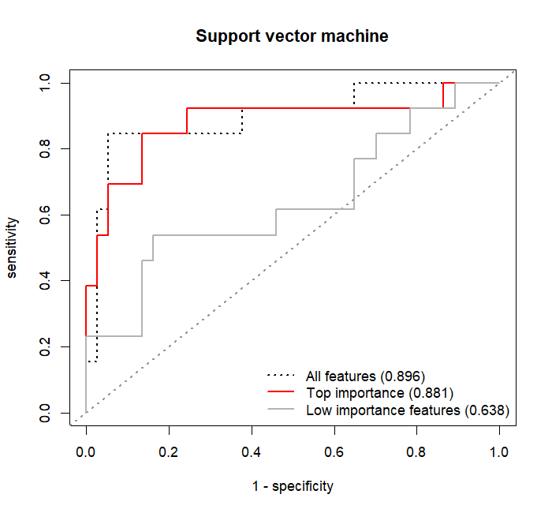  |

### 17. Predict on held-out data

`predict()` goes to the **result**, not to `$fit`. The engine object knows only the column names it was handed: `glmnet` and `kernlab` were given a design matrix and read it by position, so a frame whose numeric columns are in a different order is multiplied by the wrong coefficients without any error, and a factor predictor is dropped from it entirely. The result object is the only thing that knows which columns were predictors and what the levels of a factor were, so one line covers all five models:

```r
predict(lin,     newdata = test_data)                     # numeric
predict(log_fit, newdata = cls_test, type = "raw")        # factor, outcome_lv
predict(log_fit, newdata = cls_test, type = "prob")       # one column per class
predict(log_fit, newdata = cls_test, type = "response")   # P(outcome_lv[2])
```

Extra columns in `newdata` are ignored, a missing one is an error that names it, and a level the training data never saw is an error that names both the column and the level. A level that is missing from `newdata` is not an error: its dummy column is simply zero, since the levels come from `design$predictor_lv` rather than from the new rows. One prediction comes back per row, and a row with a missing value in a predictor is `NA` rather than dropped, so the answer stays aligned with `newdata`.

---

# Part 3 — Dimension reduction

Everything above had an answer to score against. These three have none. What can be asked is where each point lands when many features are pressed into two dimensions, and the three answer differently on purpose: PCA is a rotation, so it is reversible and says which feature moved a point, but it only finds straight structure; t-SNE and UMAP find curved structure but cannot say which feature made it.

### 18. `perform_pca()`, `perform_tsne()` and `perform_umap()`

Three functions rather than one call with a `methods` argument, because they answer in coordinates that share no scale — nothing but `points` could be joined between them — and because `perplexity`, `n_neighbors` and `metric` each belong to exactly one of them. What makes them comparable is the input: all three read `data` the same way, so the same rows drop for the same reason.

`embedding_scale` chooses which margin becomes the points. The input is one row per sample as everywhere else in the package, and `design$point_type` reports which axis was embedded.

```r
red_cor <- make_block_cor(
  n_features = 8,
  blocks = list(
    list(features = 1:2, cor = 0.8),
    list(features = 3:5, cor = 0.5),
    list(features = 7:8, cor = 0.9)
  )
)
red_data <- simulate_classification(cor_mat = red_cor, seed = 2026)$args$data

pca <- perform_pca(
  data            = red_data,
  feats           = paste0("x_", 1:8),
  embedding_scale = "features",
  center          = TRUE,
  scale           = TRUE
)

pca
pca$scores[, 1:3]
```

```
<sa_reduction> pca
  data     : 200 sample(s) x 8 feature(s)
  points   : 8 feature(s)
  scaling  : centred and scaled
  variance : PC1 25.88%, PC2 24.46%, PC3 22.3% (3 of 8 component(s), 72.64%
             cumulative)
```

```
  points        PC1      PC2
1    x_1 -1.1565840 9.030714
2    x_2  0.2042277 9.636624
3    x_3  9.9079045 4.897448
4    x_4  9.4190232 5.584413
5    x_5 10.1635916 3.756129
6    x_6 -3.0399404 1.583551
7    x_7 -7.8137355 8.413601
8    x_8 -7.0841229 8.507287
```

The three blocks come out as three groups and `x_6`, which belongs to none, sits on its own:

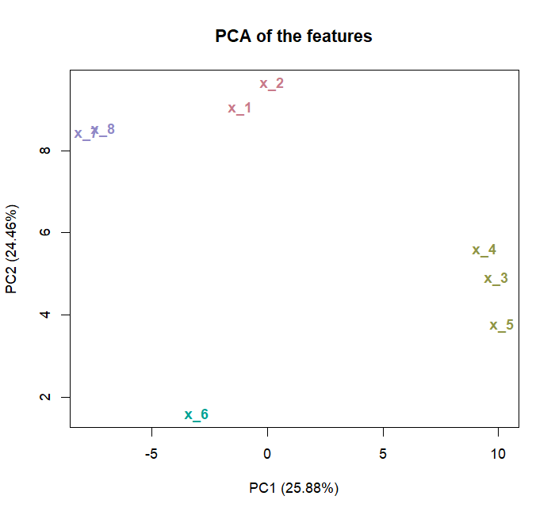

PCA is a singular value decomposition, so one fit answers both margins at once and the matrix is never turned around. `embedding_scale = "features"` rescales the rotation from unit length to variance-weighted length and puts the sample scale in `$loadings`; `$variance` and `$fit` are not touched, so the axis labels are the same either way.

```r
by_sample <- perform_pca(data = red_data, feats = paste0("x_", 1:8))
all.equal(pca$variance, by_sample$variance)
#> [1] TRUE
```

Transposing the input by hand instead is a **third** analysis, not the same one: `prcomp()` always centres and scales the columns it is given, so `perform_pca(t(data))` standardises samples rather than features. The shapes match, the picture reads, and the answer is to a different question. This is the one mistake in these three functions that produces a plot instead of an error, which is why all three document it.

`perform_tsne()` sees literally the same matrix `perform_pca()` did, which needs two of `Rtsne`'s defaults turned off: `normalize = TRUE` would overwrite the `center` and `scale` that were asked for, and `pca = TRUE` would show t-SNE a rotation rather than the matrix. Both overrides are recorded in `engine$overridden`.

```r
tsne <- perform_tsne(
  data            = red_data,
  feats           = paste0("x_", 1:8),
  embedding_scale = "features",
  center          = TRUE,
  scale           = TRUE,
  seed            = 2026
)
tsne
```

```
<sa_reduction> tsne
  data     : 200 sample(s) x 8 feature(s)
  points   : 8 feature(s)
  scaling  : centred and scaled
  tsne     : 2 dimension(s), perplexity = 2, theta = 0.5  (seed = 2026)
```

`perform_umap()` is the one that standardises nothing by default, because `metric` is its own argument and `"cosine"` or `"pearson"` compares the shape of a row rather than its size, which already answers what standardising would. Both neighbourhood sizes are read from the engine's limits when they are `NULL`, and both are read from the number of **points** rather than the number of samples — with eight features that is small enough to be worth a message:

```r
umap_res <- perform_umap(
  data            = red_data,
  feats           = paste0("x_", 1:8),
  embedding_scale = "features",
  n_neighbors     = 3,
  center          = FALSE,
  scale           = FALSE,
  seed            = 2026
)
umap_res
#> Only 8 feature(s) to embed (n_neighbors = 3). This method describes a
#> neighbourhood, and below about 16 points there is not much of one to describe.
```

```
<sa_reduction> umap
  data     : 200 sample(s) x 8 feature(s)
  points   : 8 feature(s)
  scaling  : none, values as they arrived
  umap     : 2 dimension(s), method = naive, n_neighbors = 3, min_dist = 0.1, euclidean  (seed = 2026)
```

| t-SNE | UMAP |
| --- | --- |
| 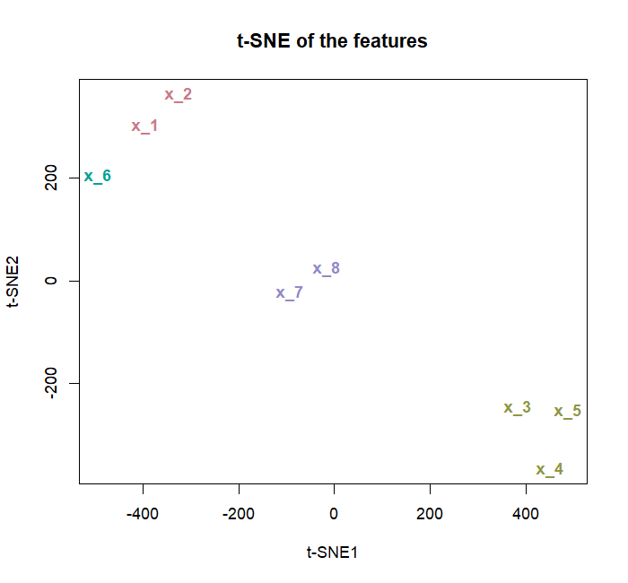 | 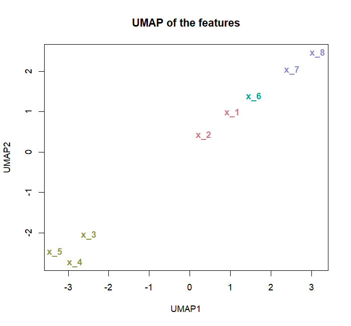 |

The coordinates are `$scores` in all three and the engine object is `$fit`. `seed` buys different things in the two stochastic methods: `umap` restores the random stream itself, so two seedless calls agree, while two seedless `Rtsne` calls do not.

---

## Main functions

| Function | Purpose |
| --- | --- |
| `compare_two_groups()` | Welch / Wilcoxon / robust tests plus fold change for two groups |
| `compare_multiple_groups()` | Four omnibus tests for three or more groups, each with its matching post-hoc stage; independent or repeated |
| `compare_one_sample()` | One-sample t, signed-rank and proportion tests against a hypothesised value |
| `diagnose_distribution()` | Normality, homogeneity of variance and outliers for a set of features |
| `screen_outliers()` | Flag observations by IQR fences, robust z or Grubbs, without removing them |
| `estimate_significance()` | Filter features by log2FC and p-value from any comparison result, over the omnibus test or one pairwise contrast at a time |
| `summarize_descriptive_stats()` | Feature-wise (and optional group-wise) descriptive table |
| `draw_forest_plot()` | Forest plot of estimates, of pairwise contrasts, or of p-values; `plot()` on a `sa_comparison` calls it |
| `draw_volcano_plot()` | Volcano plot from `estimate_significance()` output |
| `draw_grouped_boxplot()` | Boxplots for several features x group levels |
| `draw_heatmap()` | Clustered heatmap of features x samples, with the sample groups annotated |
| `draw_butterfly_hist()` | Back-to-back histogram, kernel density, or both, for exactly two groups |
| `split_data()` | Train/test partition, stratified and leakage-aware through `id` |
| `fit_linear_regression()` | Linear model with coefficient inference and resampled performance |
| `fit_logistic_regression()` | Two-class logistic model with odds ratios and their intervals |
| `fit_elastic_net()` | LASSO, ridge or elastic net for either outcome type, with the selected terms |
| `fit_rf()` | Random forest with permutation and impurity importance and out-of-bag fit |
| `fit_svm()` | Radial-kernel support vector machine with permutation importance |
| `perform_pca()` | Principal components of the samples or of the features, with loadings and variance |
| `perform_tsne()` | t-SNE embedding of either margin |
| `perform_umap()` | UMAP embedding of either margin |
| `simulate_two_groups()` | Two-group log2 expression data with the planted answer returned alongside it |
| `simulate_multiple_groups()` | One control and any number of treatment groups, scored per feature, per level and per contrast |
| `simulate_regression()` | Continuous outcome from planted coefficients, with a correlation structure and the truth per predictor and per term |
| `simulate_classification()` | Two-class outcome at a chosen event rate from the same design |
| `make_block_cor()` | Block correlation matrix for the simulators, checked for positive definiteness |

---

## Author

**Wonseok Oh** ([ORCID: 0009-0002-0687-8466](https://orcid.org/0009-0002-0687-8466))

## License

MIT © 2026 Wonseok Oh. See [LICENSE.md](LICENSE.md) for details.
